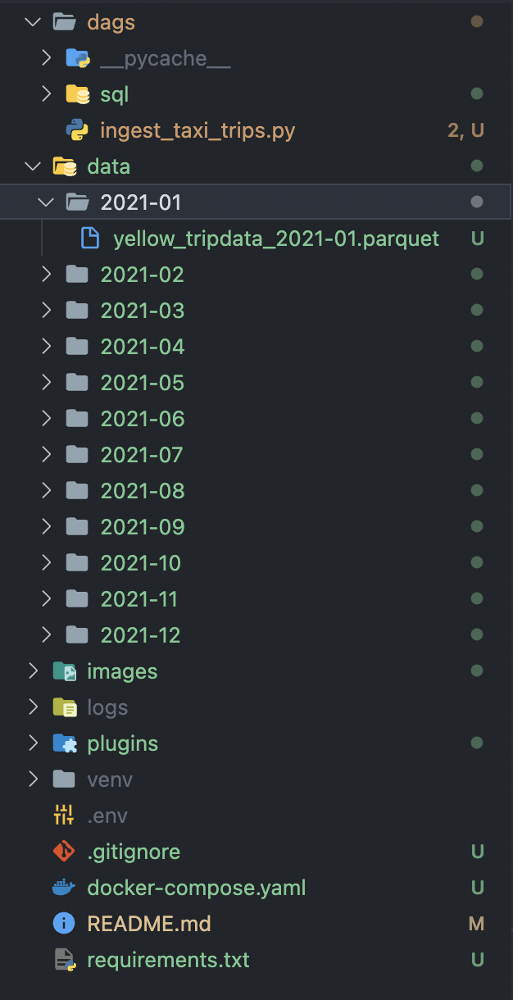
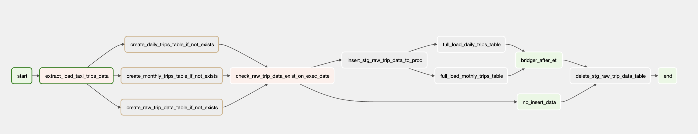

# Assignment ETL using Airflow

# About
Simple system to perform ETL from local filesystem with parquet format to PostgreSQL. This project is utilizing:
- Macros / reference
- Branch Operator to skip certain tasks
- PostgreSQLOperator with file based sql
- EmptyOperator as the replacement for DummyOperator that is deprecated

Build with **Airflow 2.4.1**

## Data Source
The data source was downloaded from [NTC Taxi Trips](https://www1.nyc.gov/site/tlc/about/tlc-trip-record-data.page) website from January 2021 to December 2021 in Parquet format.

After download, place it under `./data/{YYYY-MM}` folder based on when the data created. This image below will tell you the final structure. 


# No Primary Key on Table ?
Yes, there is no any unique key from the table source. So at first I thought by creating surrogate key will solve the problem, but turns out the computation is not efficient and leads to `SIGTERM KILL` raised by Airflow.

Moreover if we are using [SQL Alchemy ORM](https://docs.sqlalchemy.org/en/14/orm/), it **requires** us to specify the Primary Key.

## Surrogate Key
The idea is to create a new key which contains of md5 hash from concatenated rows on each record.

And yes, we are possible to create by hash on some columns, but it still doesn't solve the problem since there are still possibilities of data duplicates.

Making all columns to be Primary Key is also didn't solve the problem, though it's not efficient way. Because there are some null values at some columns while PK prohibit us to have null value.

# The Final Approach
Creating table by using SQL script and run it on top of PostgreSQLOperator. The example of script is:
```
CREATE TABLE IF NOT EXISTS public.raw_trip_data (
    vendor_id INTEGER,
    tpep_pickup_datetime TIMESTAMP,
    tpep_dropoff_datetime TIMESTAMP,
    trip_period TEXT,
    passenger_count INTEGER,
    trip_distance FLOAT,
    rate_code_id INTEGER,
    store_and_fwd_flag TEXT,
    pu_location_id INTEGER,
    do_location_id INTEGER,
    payment_type INTEGER,
    fare_amount FLOAT,
    extra FLOAT,
    mta_tax FLOAT,
    tip_amount FLOAT,
    tolls_amount FLOAT,
    improvement_surcharge FLOAT,
    total_amount FLOAT,
    congestion_surcharge FLOAT,
    airport_fee FLOAT
)
```

The main goals to have a Primary Key is not only because most of DBMS required it (or really recommend to have one) but because we want to make sure there is **no any duplication data** while the DAG is running or after it's done running.

So to solve this issue I am making sure the DAG's task will not fetch any data that has been fetched on previous task instance, with the help of `{{ data_interval_start }}` and `{{ data_interval_end }}` which are Airflow Macros:

Let's say the task is starting to running at 2021-01-01, so my task instance will fetch data source and inserting them to staging table between:
- 2021-01-01 23:00:00 (inclusive) and 2021-01-02 23:00:00 (exclusive)
- 2021-01-02 23:00:00 (inclusive) and 2021-01-03 23:00:00 (exclusive)
- 2021-01-03 23:00:00 (inclusive) and 2021-01-04 23:00:00 (exclusive)
- and so forth...

# DAG Architecture


## Explanation
1. Fetch (extract) and load the data into staging schema
2. Create 3 prod tables (raw_trip_data, daily_trips and monthly_trips) IF NOT EXISTS.
3. Check whether need to insert the data from staging table to prod table or not by checking the row counts.
    - If any rows returned, skip by proceed to "no_insert_data"
    - If no rows returned, proceed to insert the data to prod table. It means that there is no any data between those dates on prod table.
4. Transform and insert data from raw_trip_data on prod schema to two tables (daily_trips and monthly_trips)
5. Delete raw_trip_data staging table.
6. Done.